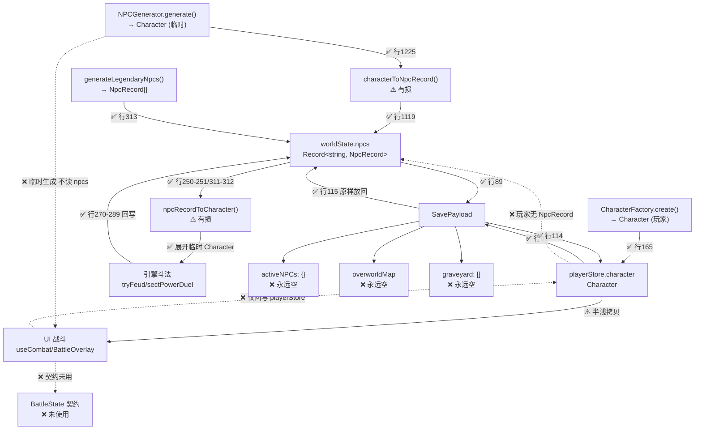

# Phase 0 Task 1：实体真实数据流与调用图

> 审计文档 · 2026-08-10
> 归属：[统一修仙世界模拟架构方案](../systemic-cultivation-world-blueprint.md) Phase 0
> 权限：只读取证，不修改运行时代码

## 方法论约束

吸取前三轮讨论教训，本次审计严格遵守：

1. **禁止用关键词 grep 推断"存在/不存在"**——前两轮曾因搜索词 `expandNpc/toCharacter` 漏掉实际命名为 `npcRecordToCharacter` 的函数，得出"桥不存在"的错误结论
2. **按类型引用（package.json `name` + `exports`）、import 关系、调用链交叉验证**
3. 每条断言给出 **文件路径 + 行号 + 代码片段**
4. 三档标注：`[TYPE]` 类型定义存在 / `[RT]` 运行时调用存在 / `[TEST]` 测试存在

包解析确认：`@taosim/contracts` / `@taosim/engine` 经 workspace packages（非 tsconfig paths）解析；`apps/taosim-ui` 内部用 `@/*` → `./src/*`。

## A. 生成路径（世界 NPC 从哪来）

### A1. WorldEngine 生成 NPC 产出 NpcRecord

生成路径是 `Character → NpcRecord`：先用 `NPCGenerator.generate` 造 Character，再立即 `characterToNpcRecord` 归档。

| 文件 | 行号 | 证据 | 说明 |
|------|------|------|------|
| `packages/engine/src/world/world-engine.ts` | 1209-1254 | `private spawnWildCultivator(...): NpcRecord { ... const character = NPCGenerator.generate(tier, seed); ... const record = characterToNpcRecord({...character, id, name}, ...) }` | `[RT]` 散修生成入口，返回 `NpcRecord` |
| `packages/engine/src/world/world-engine.ts` | 1115-1119 | `if (Object.keys(this.state.npcs).length < 800) { ... const npc = this.spawnWildCultivator(); this.state.npcs[npc.id] = npc; }` | `[RT]` 写入 `state.npcs`（NpcRecord 字典） |
| `packages/engine/src/interaction/npc-generator.ts` | 100 | `static generate(tier: number, seed: number): Character {` | `[RT]` NPCGenerator 产出 Character（中间产物） |
| `packages/engine/src/world/legendary-npc-generator.ts` | 312-313 | `export function generateLegendaryNpcs(): NpcRecord[] { return LEGENDARY_SEEDS.map(toNpcRecord); }` | `[RT]` 开局传奇 NPC 直接产出 NpcRecord |

**结论**：`state.npcs` 存的是 NpcRecord。✅ 类型与存储一致。

### A2. 玩家创建角色产出 Character，玩家无 NpcRecord

| 文件 | 行号 | 证据 | 说明 |
|------|------|------|------|
| `apps/taosim-ui/src/pages/CreateCharacterPage.vue` | 155-166 | `const character = CharacterFactory.create({...}); playerStore.setPlayer(character);` | `[RT]` 玩家产出 Character |
| `packages/engine/src/character/character-factory.ts` | 95 | `static create(params: CreateCharacterParams): Character {` | `[TYPE]` 返回 Character |
| `apps/taosim-ui/src/stores/player.ts` | 8 | `const character = ref<Character \| null>(null);` | `[RT]` 玩家态存为 Character |
| `apps/taosim-ui/src/stores/app.ts` | 54-67 | `async initialize(_playerId) { ... npcs: Object.fromEntries(generateLegendaryNpcs().map(n => [n.id, n])) }` | `[RT]` initialize 时玩家 Character **未** 放入 worldState.npcs |

**断点 F-7**：玩家 Character 永不进入 `worldState.npcs`，玩家与世界 NPC 关系网是单向的（NPC 之间有 relations，NPC 与玩家无）。

## B. 持久化路径（什么被存档）

### B3. SavePayload 字段实际填充情况

| 字段 | 契约类型 | app.ts saveGame 实际写入 | 行号 | 填充状态 |
|------|----------|--------------------------|------|----------|
| `header` | `SaveHeader` | 真实写入 | 77-88 | ✅ 完整 |
| `worldState` | `WorldState` | `toPlain(this.currentWorldState)` | 89 | ✅ 完整（含 npcs/eventLog/factions） |
| `player` | `Character` | `toPlain(player)` | 90 | ✅ 完整 |
| `activeNPCs` | `Record<string, Character>` | `{}` | 91 | ❌ **永远空对象**（F-1） |
| `factions` | `Record<string, Faction>` | `toPlain(this.currentWorldState.factions ?? {})` | 92 | ⚠️ 与 worldState.factions 冗余 |
| `overworldMap` | `OverworldMap` | `{ continents: [] }` | 93 | ❌ **永远空大陆**（F-2） |
| `graveyard` | `GraveMarker[]` | `[]` | 94 | ❌ **永远空数组**（F-3） |
| `marketInventories` | `Record<string, MarketInventory>` | `{}` | 95 | ❌ 永远空 |
| `npcTradeOffers` | `Record<string, NPCTradeOffer>` | `{}` | 96 | ❌ 永远空 |
| `playerMapState` | `PlayerMapState \| undefined` | `toPlain(mapStore.state)` | 98 | ✅ 完整 |

### B4. saveGame 完整字段映射

```
SavePayload.field         ←  数据来源
─────────────────────────────────────────────
header.saveId             ← `save_${Date.now()}`
header.schemaVersion      ← 硬编码 3
header.gameVersion        ← 硬编码 '0.2.0'
header.timestamp          ← Date.now()
header.playTimeMonths     ← (currentYear-1)*12 + currentMonth-1
header.playerSummary      ← { player.name, player.realm, 'default' }
worldState                ← toPlain(currentWorldState)  [NpcRecord 在此]
player                    ← toPlain(playerStore.character)
activeNPCs                ← {}                          [F-1 死字段]
factions                  ← toPlain(worldState.factions ?? {})  [冗余]
overworldMap              ← { continents: [] }          [F-2 死字段]
graveyard                 ← []                          [F-3 死字段]
marketInventories         ← {}                          [死字段]
npcTradeOffers            ← {}                          [死字段]
playerMapState            ← toPlain(mapStore.state)
```

## C. 展开路径（NpcRecord ↔ Character 转换）

### C5. characterToNpcRecord 全调用点

| 文件 | 行号 | 语境 | 调用方期望 |
|------|------|------|-----------|
| `packages/engine/src/world/world-engine.ts` | 1225 | 生成 | spawnWildCultivator 归档新散修 |
| `packages/engine/src/__tests__/market-flow.test.ts` | 102 | 测试 | 测试内构造 NpcRecord |
| `packages/engine/src/__tests__/npc-record-mapper.test.ts` | 21, 37, 54, 70 | 测试 | 转换器单测 |

### C6. npcRecordToCharacter 全调用点

| 文件 | 行号 | 语境 | 调用方期望 |
|------|------|------|-----------|
| `packages/engine/src/world/world-social-rules.ts` | 250 | 战斗（寻仇） | `ensureRealmWeapon(npcRecordToCharacter(attacker))` → runFeudDuel |
| `packages/engine/src/world/world-social-rules.ts` | 251 | 战斗（寻仇） | `ensureRealmWeapon(npcRecordToCharacter(target))` → runFeudDuel |
| `packages/engine/src/world/world-social-rules.ts` | 311 | 战斗（夺位） | `ensureRealmWeapon(npcRecordToCharacter(challenger))` → sectPowerDuel |
| `packages/engine/src/world/world-social-rules.ts` | 312 | 战斗（夺位） | `ensureRealmWeapon(npcRecordToCharacter(incumbent))` → sectPowerDuel |
| `packages/engine/src/__tests__/market-flow.test.ts` | 104 | 测试 | 展开后做交易测试 |
| `packages/engine/src/__tests__/npc-record-mapper.test.ts` | 38, 55, 71 | 测试 | 转换器单测 |

**关键发现**：`npcRecordToCharacter` 在**生产代码中仅被 world-social-rules.ts 的引擎内斗法调用**。UI 层的玩家战斗（BattleOverlay.vue）**完全不调用**。

### C7. 其他 NpcRecord ↔ Character 转换方式（旁路）

| 文件 | 行号 | 旁路方式 | 说明 |
|------|------|----------|------|
| `apps/taosim-ui/src/game/panels/NpcPanel.vue` | 66 | `enemy: { ...npc.value }` | ⚠️ 浅拷贝 Character |
| `apps/taosim-ui/src/game/BattleOverlay.vue` | 52-56 | `{ ...player.value, skills: [...], skillCooldowns: {...} }` | ⚠️ 半浅拷贝（item 引用共享） |
| `apps/taosim-ui/src/game/panels/MapPanel.vue` | 375 | `NPCGenerator.generate(tier, Date.now())` | ❌ 直接 new Character，不经 NpcRecord |

## D. 战斗接入路径（Character → BattleState）

### D7. 玩家切入战斗的构造路径

| 文件 | 行号 | 证据 | 说明 |
|------|------|------|------|
| `apps/taosim-ui/src/game/BattleOverlay.vue` | 52-56 | `const playerClone = computed<Character>(() => ({ ...player.value, skills: [...player.value.skills], skillCooldowns: { ...player.value.skillCooldowns } }))` | ⚠️ 半浅拷贝 |
| `apps/taosim-ui/src/game/BattleOverlay.vue` | 58-63 | `const combat = useCombat(battleMap.value, player.value.id, playerClone.value, [enemy.value])` | `[RT]` 传入 useCombat |
| `apps/taosim-ui/src/composables/useCombat.ts` | 71-73 | `const allChars = [player, ...enemies]; const charMap = Object.fromEntries(allChars.map(c => [c.id, reactive(c)]))` | `[RT]` 存入 `state.characters` |
| `apps/taosim-ui/src/composables/useCombat.ts` | 76 | `const engine = new CombatEngine(mapState, allChars)` | `[RT]` 传 CombatEngine |

**断点 F-5**：`useCombat.state.characters` 是 `Record<string, Character>`，**不是**契约 `BattleState`（battle.ts:69-81）。契约 `BattleState`/`BattleUnit` 在 UI 战斗路径中完全未使用。

### D8. 世界 NPC 切入战斗完全绕过 worldState.npcs

| 路径 | 文件 | 行号 | 证据 | 说明 |
|------|------|------|------|------|
| 地图遭遇战 | `MapPanel.vue` | 374-377 | `const enemy = NPCGenerator.generate(tier, Date.now()); enemy.name = ['赤眼狼妖',...][...]; uiStore.startBattle({ enemy, type: 'encounter', ... })` | ❌ 临时生成 |
| 偶遇 NPC | `hex-overworld-engine.ts` | 289-298 | `const npc = NPCGenerator.generate(tier, Date.now()); events.push({ type: 'npc_meet', ..., npc })` | ❌ 临时生成 |
| 切磋入口 | `NpcPanel.vue` | 65-70 | `uiStore.startBattle({ enemy: { ...npc.value }, type: 'duel', ... })` | ⚠️ npc.value 是上面的临时 Character |

**断点 F-4（最严重）**：UI 战斗的 enemy 永远来自 `NPCGenerator.generate()`，`worldState.npcs` 的 NpcRecord 永不参战。

### D9. UI 战斗结束后无回写

| 文件 | 行号 | 证据 | 说明 |
|------|------|------|------|
| `BattleOverlay.vue` | 121-158 | `function applyOutcome(outcome) { ... c.hp = outcome.playerHpAfter; c.cultivation.currentExp += outcome.expGained; ... }` | `[RT]` 仅回写 playerStore |
| `BattleOverlay.vue` | 136-138 | `if (outcome.favorabilityChange > 0 && enemy.value.id in c.relations)` | ⚠️ enemy.id 是临时 NPC 的 id，与 worldState.npcs 不对应 |
| `useCombat.ts` | 240-243 | `if (defender.hp <= 0) { defender.soulState = 'RemnantSoul' }` | `[RT]` 标记在 `state.characters` 副本，组件销毁丢弃 |

**对比：引擎内斗法的回写是健康的**

| 文件 | 行号 | 证据 | 说明 |
|------|------|------|------|
| `world-social-rules.ts` | 270-289 | `loser.lifespan.maxLifespan = ...; loser.soulState = 'PrimordialSoul'; loser.spiritStones += ...` | `[RT]` ✅ 直接 mutate NpcRecord 引用 |

## E. 读档路径

### E10. loadGame 字段读取情况

| 字段 | 是否读取 | 行号 | 说明 |
|------|----------|------|------|
| `player` | ✅ | 114 | `playerStore.setPlayer(payload.player)` |
| `worldState` | ✅ | 115 | `this.currentWorldState = payload.worldState` |
| `playerMapState` | ✅ 条件 | 119-121 | `if (payload.playerMapState) mapStore.hydrateFromSave(...)` |
| `activeNPCs` | ❌ 忽略 | — | 无读取 |
| `factions` | ⚠️ 间接 | 115 | 经 worldState.factions |
| `overworldMap` | ❌ 忽略 | — | 无读取 |
| `graveyard` | ❌ 忽略 | — | 无读取 |
| `marketInventories` | ❌ 忽略 | — | 无读取 |
| `npcTradeOffers` | ❌ 忽略 | — | 无读取 |

### E11. 读档后 npcs 无转换

`app.ts:115` 直接 `this.currentWorldState = payload.worldState`，NpcRecord 字典原样放回。✅ 无有损转换。

## F. 已知断点汇总

### F-1. `activeNPCs` 死字段
- **位置**：save-system.ts:40 定义；app.ts:91 写 `{}`；全仓无读取
- **性质分类**：**待决策**——可能是废弃契约（原设计想缓存展开态），也可能是未来活动场景快照的占位。不能仅凭写空推导根因（见 Task 4 进一步判决）

### F-2. `overworldMap` 永远空大陆
- **位置**：save-system.ts:42 定义；app.ts:93 写 `{ continents: [] }`
- **性质分类**：**未实现功能**——大地图状态当前由 mapStore 独立管理（playerMapState 字段已接），此字段可能是早期设计遗留。需判断是否与 playerMapState 重复

### F-3. `graveyard` 永远空数组
- **位置**：save-system.ts:45 定义；app.ts:94 写 `[]`
- **性质分类**：**未实现功能**——死亡 NPC 在 world-engine.ts:1097-1100 是 `delete this.state.npcs[id]`，没有生成 GraveMarker。这与方案的"事实账本不可删除历史"有冲突

### F-4. UI 战斗与世界 NPC 完全断流（最严重）
- **位置**：hex-overworld-engine.ts:292、MapPanel.vue:375 临时生成 Character
- **性质分类**：**真实缺陷**——方案 §4.3 要求"NPC 遇见玩家时必须来自世界档案"，当前完全不是
- **影响**：世界引擎模拟的社交关系、寻仇、夺位、传承等叙事玩家永远体验不到

### F-5. `BattleState`/`BattleUnit`/`BattleDelta` 契约未使用
- **位置**：battle.ts:69-81 定义 BattleState；useCombat.ts:8-25 用自定义 CombatState
- **性质分类**：**废弃契约 + 待决策**——契约层定义了一套未被 UI 采用的类型，需要 Task 5 判决哪套是收敛目标

### F-6. `BattleDelta` 回写契约未接入
- **位置**：battle.ts:92-103 定义；player.ts:4 import 了类型但未使用
- **性质分类**：**未实现功能**——方案 ADR-7 要求的差量结算完全没接

### F-7. 玩家无 NpcRecord（关系网单向）
- **位置**：app.ts:54-67 initialize 不建 NpcRecord
- **性质分类**：**待决策设计**——按本轮授权"不预设玩家必须拥有 NpcRecord"。目标可能是用稳定 ID + 权威查询统一，避免双份权威数据

### F-8. `npcRecordToCharacter` 展开是有损转换
- **位置**：npc-record-mapper.ts:139-186
- **有损点**：
  - 行 166：spiritEnergy 按公式重算（`100 + tier*50`）
  - 行 167：monthlyActionPoints 硬编码 `{current:3, max:3}`
  - 行 170：gameMode 硬编码 `{breakthrough:'Simple', saveMode:'Free'}`
  - 行 171：hp 按公式重算（`100 + tier*80 + physique*5`），**不保留战斗后残血**
  - 行 173：ap 硬编码 2
  - 行 175：inventory 永远 `[]`
  - 行 179：traits 永远 `[]`
  - 行 184：wantedLevels 永远 `{}`
  - 行 185：unlockedRecipes 永远 `[]`
  - 行 152：hatred 从 bond 单向推导，jealousy 永远 0
- **性质分类**：**部分缺陷 + 部分待决策**——hp 回满在引擎内斗法场景是可接受的低精度模拟（NpcRecord 无 hp 字段，每次展开本就要重算）；但用于玩家遭遇战时就是缺陷（战斗后残血不保留）

### F-9. `characterToNpcRecord` 归档也是有损
- **位置**：npc-record-mapper.ts:22-73
- **有损点**：
  - 行 53：origin 永远 `{ type: '散修' }`
  - 行 54：destiny 永远 `{ tier:'common', born:'mortal', hidden:true }`
  - 行 58：locationId 永远 undefined
  - 行 70：biography 永远 `{ milestones:[], summary:'' }`
  - 行 40：relations.trust 永远 50，events 永远 `[]`
- **性质分类**：**部分缺陷**——但 world-engine.ts:1235-1253 的 spawnWildCultivator 会二次覆盖 origin/destiny，实际归档时是有修正的。主要风险在于 UI 场景误用此函数做战后整体回写

## 数据流总图



**图例**：✅ 正常流通 | ⚠️ 有损转换 | ❌ 断点/死字段/未接入

## 关键结论（按严重度）

1. **F-4（最严重）**：UI 战斗与世界 NPC 完全断流。玩家打的敌人是 `NPCGenerator.generate()` 的临时产物，`worldState.npcs` 的叙事 NPC 永不参战。`npcRecordToCharacter` 在 UI 层零调用。
2. **F-5/F-6**：`BattleState`/`BattleUnit`/`BattleDelta` 契约类型在 UI 战斗中完全不使用，UI 用自定义 `CombatState` + 散写字段回写。
3. **F-7**：玩家无 NpcRecord，世界 NPC 关系网不含玩家。需要 Task 4 判决方向。
4. **F-1/F-2/F-3**：SavePayload 五个字段是死字段，但根因不同——activeNPCs 可能是废弃契约，overworldMap 可能与 playerMapState 冲突，graveyard 是未实现功能。Task 4 分别判决。
5. **F-8/F-9**：两个转换器都有固有信息损失，但引擎内斗法路径（world-social-rules）是自洽的。风险在于 UI 场景误用。
